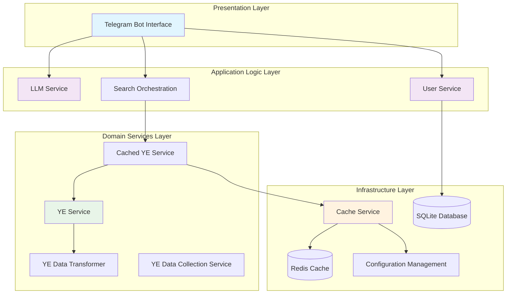
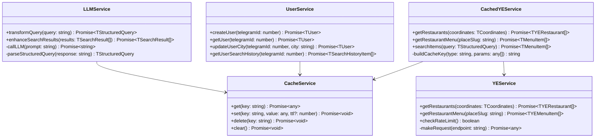
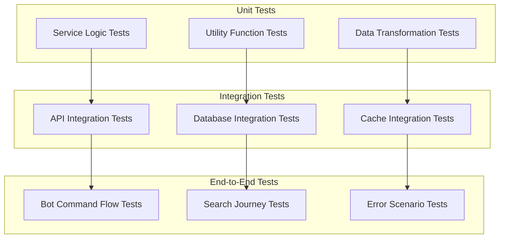

# Food Talker Design System Documentation

## Overview

The Food Talker system is a Node.js-based Telegram bot application designed for intelligent food search and restaurant recommendations. Built with TypeScript and leveraging modern architectural patterns, the system integrates multiple external services including Yandex.Eda API and LLM services to provide natural language food search capabilities.

**Current Implementation Status**: The project is in active development with core services, data models, and infrastructure components implemented. The bot interface layer is planned but not yet implemented.

## Technology Stack & Dependencies

### Core Technologies
- **Runtime**: Node.js (>=22.15.0 <23.0.0)
- **Language**: TypeScript (^5.8.3)
- **Package Manager**: npm (>=10.0.0)
- **Execution**: ts-node for development

### Key Dependencies
- **Bot Framework**: Telegraf (^4.16.3) - Telegram Bot API wrapper
- **Databases**: SQLite3 (^5.1.7) for persistence, Redis (^5.8.2) for caching
- **Task Scheduling**: node-cron (^4.2.1) for periodic data updates
- **Testing**: Vitest (^3.2.4) with comprehensive test coverage
- **Linting**: ESLint (^9.25.1) with stylistic and perfectionist plugins
- **Utilities**: lodash, uuid, jsonrepair, dotenv

## Architecture Overview

### High-Level Architecture



### Architectural Layers

#### 1. Presentation Layer
- **Telegram Bot Handlers**: Process user commands and messages
- **Middleware**: Authentication, rate limiting, error handling
- **Message Formatting**: Response presentation and inline keyboards

#### 2. Application Logic Layer
- **LLM Service**: Natural language query transformation and result enhancement
- **User Service**: User lifecycle management and context handling
- **Search Orchestration**: Coordinates between services for complex queries

#### 3. Domain Services Layer
- **YE Service**: Direct Yandex.Eda API integration with rate limiting
- **YE Data Transformer**: Raw API data to domain model transformation
- **Cached YE Service**: Performance optimization with intelligent caching
- **YE Data Collection Service**: Automated data synchronization

#### 4. Infrastructure Layer
- **Cache Service**: Multi-provider caching abstraction (Redis/Memory)
- **Database Management**: SQLite connection pooling and migrations
- **Configuration Management**: Environment-aware configuration system
- **Logging & Monitoring**: Structured logging and error tracking

## Component Architecture

### Service Layer Architecture



### 1. Bot Layer (Planned - Not Yet Implemented)

**Note**: The bot interface layer is currently planned but not implemented. The directory structure exists (`src/bot/handlers/`, `src/bot/middleware/`) but contains no files.

**Planned Bot Handler Interface**:
```typescript
interface TBotHandler {
  start(): Promise<void>
  stop(): Promise<void>
  handleMessage(ctx: TTelegrafContext): Promise<void>
  handleCommand(ctx: TTelegrafContext): Promise<void>
}
```

**Planned Command Handlers**:
- `/start` - User registration
- `/help` - Help information
- `/address` - Change delivery city
- `/history` - Search history
- `/cancel` - Cancel current action

### 2. User Management (`src/services/user/`)

**UserService** - Управление пользователями
```typescript
interface TUserService {
  createUser(telegramId: number, chatId: number): Promise<TUser>
  getUser(telegramId: number): Promise<TUser | null>
  updateUserCity(telegramId: number, city: string): Promise<TUser>
  updateSubscription(telegramId: number, subscription: TSubscriptionType): Promise<TUser>
  checkSubscriptionExpiry(): Promise<TUser[]>
}

interface TUser {
  telegramId: number
  chatId: number
  city: EAvailableCities
  subscription: ESubscriptionType
  subscriptionExpiry: Date | null
  createdAt: Date
  updatedAt: Date
}

enum ESubscriptionType {
  BASIC = 'basic',
}

enum EAvailableCities {
  PERM = 'Пермь',
  VORONEZH = 'Воронеж',
}
```

### 3. Search Engine (`src/services/search/`)

**SearchService** - Основной поисковый сервис
```typescript
interface TSearchService {
  searchFood(query: string, userId: number): Promise<TSearchResult[]>
  processNaturalLanguageQuery(query: string): Promise<TStructuredQuery>
  filterByGeolocation(results: TSearchResult[], city: string): Promise<TSearchResult[]>
  enhanceResultsWithLLM(results: TSearchResult[], originalQuery: string): Promise<TSearchResult[]>
}

interface TStructuredQuery {
  restaurants?: string[]
  tags?: string[]
  priceRange?: TPriceRange
  exclusions?: {
    restaurants?: string[]
    tags?: string[]
    priceRange?: TPriceRange
  }
}

interface TPriceRange {
  min: number
  max: number
}

interface TSearchResult {
  id: string
  name: string
  restaurant: TRestaurantInfo
  description: string
  tags: string[]
  price: number
  image?: string
  orderUrl: string
}
```

**LLMService** - Интеграция с Llama 3.1 8B
```typescript
interface TLLMService {
  transformQuery(naturalQuery: string): Promise<TStructuredQuery>
  enhanceSearchResults(results: TSearchResult[], query: string): Promise<TSearchResult[]>
  validateQueryStructure(query: TStructuredQuery): boolean
}
```

### 4. Data Aggregation (`src/services/data/`)

### 4. Data Aggregation (`src/services/data/yandexEda/`) - **Implemented**

**YEService** - Base Yandex.Eda API client with rate limiting and retry logic
```typescript
interface TYEService {
  getRestaurants(coordinates: TCoordinates): Promise<TYERestaurant[]>
  getRestaurantMenu(placeSlug: string, coordinates: TCoordinates, brandSlug?: string): Promise<TYEMenuItem[]>
  searchRestaurants(query: TStructuredQuery, coordinates: TCoordinates): Promise<TYERestaurant[]>
  checkRateLimit(): boolean
}

interface TYERestaurant {
  id: string
  name: string
  coordinates: TCoordinates
  workingHours: TWorkingHours
  minimumOrderAmount?: number
  lastUpdated: Date
  additionalInfo: {
    brandSlug: string
  }
}

interface TMenuItem {
  id: string
  name: string
  description: string
  ingredients: string[]
  price: number
  image?: string
  available: boolean
  restaurant: TYERestaurant
}
```


**CachedYEService** - Обёртка с кэшированием для YEService
```typescript
interface TCachedYEService {
  getRestaurants(coordinates: TCoordinates, city: EAvailableCities): Promise<TYERestaurant[]>
  getRestaurantMenu(placeSlug: string, coordinates: TCoordinates, city: EAvailableCities, brandSlug?: string): Promise<TMenuItem[]>
  searchItems(query: TStructuredQuery, coordinates: TCoordinates, city: EAvailableCities): Promise<TMenuItem[]>
  invalidateCache(pattern?: string): void
  getCacheStats(): { restaurants: number; menus: number; searches: number }
}
```

**YEDataTransformer** - Трансформация данных API в внутренние модели
```typescript
interface TYEDataTransformer {
  transformRestaurant(yePlace: TYEPlace, coordinates: TCoordinates): TYERestaurant
  transformMenuItem(yeMenuItem: TYEMenuItem, restaurant: TYERestaurant): TMenuItem
  transformRestaurants(yePlaces: TYEPlace[], coordinates: TCoordinates): TYERestaurant[]
  transformMenuItems(yeMenuItems: TYEMenuItem[], restaurant: TYERestaurant): TMenuItem[]
}
```

**YEDataCollectionService** - Планировщик обновления данных
```typescript
interface TYEDataCollectionService {
  startCollection(): Promise<void>
  stopCollection(): void
  updateRestaurantData(city?: EAvailableCities): Promise<void>
  updateMenuData(restaurantId: string, city: EAvailableCities): Promise<void>
  scheduleUpdates(): void
  getCollectionStats(): TCollectionStats
}

interface TCollectionStats {
  lastUpdateTime: Date | null
  totalRestaurants: number
  totalMenuItems: number
  updateFrequency: string
  isRunning: boolean
  errors: number
}
```

**CacheService** - Универсальный кэш с TTL и LRU
```typescript
interface TCacheService {
  get<T>(key: string): T | null
  set<T>(key: string, value: T, ttlSeconds?: number): void
  delete(key: string): void
  clear(): void
  has(key: string): boolean
  getStats(): TCacheStats
}

interface TCacheStats {
  totalKeys: number
  memoryUsage: number // bytes
  hitRate: number // 0-1
  missRate: number // 0-1
}
```

### 5. Geolocation (`src/services/geo/`)

**GeolocationService** - Работа с геолокацией
```typescript
interface TGeolocationService {
  getCityCoordinates(cityName: string): Promise<TCoordinates>
  isDeliveryAvailable(restaurant: TRestaurant, userCity: string): Promise<boolean>
  filterByDeliveryZone(restaurants: TRestaurant[], city: string): Promise<TRestaurant[]>
}

interface TCoordinates {
  latitude: number
  longitude: number
}
```

### 6. Message Formatting (`src/services/message/`)

**MessageFormatter** - Форматирование сообщений
```typescript
interface TMessageFormatter {
  formatSearchResults(results: TSearchResult[]): string
  formatRestaurantCard(restaurant: TRestaurant, items: TMenuItem[]): string
  formatWelcomeMessage(user: TUser): string
  formatErrorMessage(error: TAppError): string
  createInlineKeyboard(results: TSearchResult[]): TInlineKeyboardMarkup
}
```

## Data Models

### Core Entities

```typescript
// User Entity
interface TUser {
  telegramId: number
  chatId: number
  city: EAvailableCities
  subscription: TSubscriptionType
  subscriptionExpiry: Date | null
  searchHistory: TSearchHistoryItem[]
  createdAt: Date
  updatedAt: Date
}

// Search History
interface TSearchHistoryItem {
  id: string
  query: string
  structuredQuery: TStructuredQuery
  results: TSearchResult[]
  timestamp: Date
}

// Restaurant Data
interface TRestaurant {
  id: string
  name: string
  coordinates: TCoordinates
  workingHours: TWorkingHours
  minimumOrderAmount?: number
  lastUpdated: Date
  additionalInfo?: object
}

// Menu Item
interface TMenuItem {
  id: string
  name: string
  description: string
  ingredients: string[]
  price: number
  image?: string
  available: boolean
  restaurant: TRestaurant
}

interface TWorkingHours {
  open: string // HH:MM
  close: string // HH:MM
  isOpen: boolean
}
```

### Configuration Models

```typescript
interface TBotConfig {
  telegramToken: string
  llmApiUrl: string
  llmApiKey: string
  database: TDatabaseConfig
  cache: TCacheConfig
  yandexEda: TYandexEdaConfig
  sanitizer: TSanitizerConfig
  availableCities: EAvailableCities[]
}

interface TDatabaseConfig {
  url: string // SQLite file path
  maxConnections: number
  busyTimeout: number
}

interface TCacheConfig {
  ttl: number
  maxSize: number
  redisUrl?: string
}

interface TYandexEdaConfig {
  baseUrl: string
  headers: Record<string, string>
  rateLimits: {
    requestsPerMinute: number
    requestsPerHour: number
  }
}

interface TSanitizerConfig {
  maxLength: number
  minLength: number
}
```

## Error Handling

### Error Types

```typescript
enum TErrorType {
  API_ERROR = 'API_ERROR',
  CACHE_ERROR = 'CACHE_ERROR',
  CITY_NOT_SUPPORTED = 'CITY_NOT_SUPPORTED',
  DATA_COLLECTION_ERROR = 'DATA_COLLECTION_ERROR',
  DATABASE_ERROR = 'DATABASE_ERROR',
  LLM_ERROR = 'LLM_ERROR',
  NETWORK_ERROR = 'NETWORK_ERROR',
  RATE_LIMIT_ERROR = 'RATE_LIMIT_ERROR',
  SYSTEM_ERROR = 'SYSTEM_ERROR',
  USER_NOT_FOUND = 'USER_NOT_FOUND',
  VALIDATION_ERROR = 'VALIDATION_ERROR',
}

interface TAppError extends Error {
  type: TErrorType
  code: string
  details?: unknown
  isUserFacing: boolean
}

// Реализованы статические фабричные методы:
// AppError.validationError(), .apiError(), .networkError()
// AppError.llmError(), .databaseError(), .rateLimitError()
// AppError.systemError(), .userNotFound(), .cityNotSupported()
// AppError.cacheError(), .dataCollectionError()
```

### Error Handling Strategy

1. **User-Facing Errors** - Понятные сообщения пользователю
2. **System Errors** - Логирование и уведомление администратора
3. **Graceful Degradation** - Продолжение работы при сбоях отдельных компонентов
4. **Retry Logic** - Автоматические повторы для временных сбоев

### Error Recovery

```typescript
interface TErrorHandler {
  handleBotError(error: TAppError, ctx: TTelegrafContext): Promise<void>
  handleAPIError(error: TAppError): Promise<void>
  handleLLMError(error: TAppError, fallbackStrategy: 'simple_search' | 'cached_results'): Promise<TSearchResult[]>
  notifyAdmin(error: TAppError): Promise<void>
}
```

## Performance and Caching

### Caching Strategy

Реализован многоуровневый кэш с автоматической очисткой:

1. **CacheService** - Универсальный кэш с вариантами in-memory или Redis
   - LRU eviction при превышении maxSize
   - TTL с автоматической очисткой каждые 5 минут
   - Статистика hit/miss rate и memory usage

2. **Restaurant Data Cache** - TTL: 1 час (3600 сек)
   - Ключ: `restaurants:{city}:{coordinates}`
   - Автообновление каждые 40 минут

3. **Menu Data Cache** - TTL: 30 минут (1800 сек)  
   - Ключ: `menu:{restaurantId}:{city}:{coordinates}`
   - Ленивая загрузка при запросе

4. **Search Results Cache** - TTL: 15 минут (900 сек)
   - Ключ: `search:{city}:{coordinates}:{normalizedQuery}`
   - Стабильные ключи с нормализацией порядка параметров

5. **Cache Invalidation**
   - Автоматическая очистка просроченных записей
   - Ручная инвалидация по паттернам
   - Graceful degradation при ошибках кэша

**LLM Response Cache** - Кэширование ответов LLM для похожих запросов (TTL: 24 часа)

### Rate Limiting

Реализован в YEService с использованием sliding window:

```typescript
interface TYERateLimitState {
  requests: number[]
  lastReset: number
}

interface TYEApiConfig {
  rateLimits: {
    requestsPerMinute: number
    requestsPerHour: number
    windowSizeMs: number
  }
  timeout: number
  retries: number
}

// Лимиты (из botConfig):
// - Яндекс.Еда API: настраивается в конфигурации
// - Автоматические повторы с exponential backoff
// - Проверка лимитов перед каждым запросом

// Лимиты:
// - LLM API: 50 запросов в минуту
```

## Integration Patterns

### Yandex.Eda Integration

Реализованная архитектура состоит из трёх слоёв:

#### 1. YEService - Базовый API клиент
```typescript
class YEService {
  private readonly config: TYEApiConfig
  private rateLimitState: TYERateLimitState

  async getRestaurants(coordinates: TCoordinates): Promise<TYERestaurant[]>
  async getRestaurantMenu(placeSlug: string, coordinates: TCoordinates, brandSlug?: string): Promise<TYEMenuItem[]>
  async searchRestaurants(query: TStructuredQuery, coordinates: TCoordinates): Promise<TYERestaurant[]>
  checkRateLimit(): boolean
}
```

#### 2. YEDataTransformer - Трансформация данных
```typescript
class YEDataTransformer {
  transformPlace(yePlace: TYEPlace, coordinates: TCoordinates): TYERestaurant
  transformMenuItem(yeMenuItem: TYEMenuItem, restaurant: TRestaurant): TMenuItem
  
  // Умное извлечение ингредиентов из разных форматов описаний:
  // - Точный title "Состав"
  // - Текст с "Состав:"
  // - Автоопределение списков ингредиентов по структуре
  private extractIngredients(yeMenuItem: TYEMenuItem): string[]
}
```

#### 3. CachedYEService - Кэширующая обёртка
```typescript
class CachedYEService {
  private cacheTTL = {
    restaurants: 3600, // 1 час
    menu: 1800,        // 30 минут  
    search: 900,       // 15 минут
  }

  async getRestaurants(coordinates: TCoordinates, city: EAvailableCities): Promise<TYERestaurant[]>
  async getRestaurantMenu(placeSlug: string, coordinates: TCoordinates, city: EAvailableCities, brandSlug?: string): Promise<TMenuItem[]>
  async searchItems(query: TStructuredQuery, coordinates: TCoordinates, city: EAvailableCities): Promise<TMenuItem[]>
}
```

#### 4. YEDataCollectionService - Планировщик обновлений
```typescript
class YEDataCollectionService {
  private frequencyMin = {
    restaurant: 40, // Обновление ресторанов каждые 40 минут
    cache: 30,      // Очистка кэша каждые 30 минут
  }

  async startCollection(): Promise<void>
  stopCollection(): void
  scheduleUpdates(): void // Использует node-cron
}
```

### LLM Integration

```typescript
interface TLLMClient {
  transformQuery(query: string): Promise<TStructuredQuery>
  enhanceResults(results: TSearchResult[], originalQuery: string): Promise<TSearchResult[]>
  validateResponse(response: any): boolean
}

class LlamaService implements TLLMClient {
  private apiUrl: string
  private apiKey: string
  
  async transformQuery(query: string): Promise<TStructuredQuery> {
    // Преобразование естественного запроса в структурированный JSON
    const prompt = this.buildQueryTransformPrompt(query)
    const response = await this.callLLM(prompt)
    return this.parseStructuredQuery(response)
  }
}
```

### Database Schema

Реализована SQLite база данных с системой миграций:

```typescript
// Users Table
interface TUserEntity {
  telegram_id: number // PRIMARY KEY
  chat_id: number
  city: string
  subscription_type: string
  subscription_expiry: string | null // ISO string
  created_at: string // ISO string DEFAULT (datetime('now'))
  updated_at: string // ISO string DEFAULT (datetime('now'))
}

// Search History Table  
interface TSearchHistoryEntity {
  id: string // UUID PRIMARY KEY
  user_telegram_id: number // FOREIGN KEY
  query: string
  structured_query: string // JSON string
  results_count: number
  created_at: string // ISO string DEFAULT (datetime('now'))
}

// Restaurants Cache Table
interface TRestaurantCacheEntity {
  id: string // PRIMARY KEY
  name: string
  data: string // JSON string
  city: string
  last_updated: string // ISO string DEFAULT (datetime('now'))
  is_active: number // INTEGER DEFAULT 1 (SQLite boolean)
}

// Database Connection Management
interface TDatabaseConnection {
  query<T>(sql: string, params?: unknown[]): Promise<T[]>
  run(sql: string, params?: unknown[]): Promise<{ lastID?: number; changes: number }>
  close(): Promise<void>
}

interface TDatabasePool {
  getConnection(): Promise<TDatabaseConnection>
  closeAll(): Promise<void>
}
```

## Testing Strategy

### Test Architecture



### Test Implementation Coverage

#### Implemented Test Suites
1. **UserService Tests** - Complete service method coverage
2. **YEService Tests** - API calls, rate limiting, retry logic
3. **YEDataTransformer Tests** - Data transformation and ingredient extraction
4. **CachedYEService Tests** - Caching behavior and cache key generation
5. **YEDataCollectionService Tests** - Cron job scheduling and statistics
6. **CacheService Tests** - Provider pattern and TTL behavior

#### Test Utilities & Mocking
- **Test Framework**: Vitest (^3.2.4) with TypeScript support
- **Mock Strategy**: Comprehensive mocking of external dependencies
- **Time Control**: `vi.useFakeTimers()` for TTL and scheduling tests
- **Fetch Mocking**: Mock HTTP requests for API testing
- **Database Mocking**: In-memory database for isolation
- **Memory FileSystem**: memfs for file system mocking

#### Test Configuration
```typescript
// vitest.config.mts
export default defineConfig({
  test: {
    root: './',
    setupFiles: path.resolve(__dirname, 'src/vitest/setup.ts'),
    pool: 'threads',
    alias: {
      '@': path.resolve(__dirname, './src'),
    },
  },
});
```

### Integration Testing

1. **Bot Command Tests**
   - Тестирование команд через mock Telegram updates
   - Проверка flow регистрации пользователя
   - Тестирование поискового flow

2. **External API Tests**
   - Mock тесты для Yandex.Eda API
   - Mock тесты для LLM API
   - Тестирование error handling

### End-to-End Testing

1. **User Journey Tests**
   - Полный цикл: регистрация → поиск → результаты
   - Тестирование edge cases
   - Performance тесты

## Security Considerations

### Data Protection

1. **API Keys Security**
   - Хранение в environment variables
   - Ротация ключей
   - Шифрование sensitive данных

2. **User Data Privacy**
   - Минимизация хранимых данных
   - Соблюдение ФЗ-152
   - Автоматическое удаление старых данных

3. **Rate Limiting & DDoS Protection**
   - Лимиты на пользователя
   - Лимиты на IP
   - Graceful degradation

### Input Validation

Реализована модульная система валидации и санитизации:

#### Validation (`src/utils/validation.ts`)
```typescript
interface TValidator {
  // Input validation (from user)
  validateSearchQuery(query: string): TValidationResult
  validateCity(city: string): TValidationResult
  validateTelegramId(telegramId: number): TValidationResult
  validateChatId(chatId: number): TValidationResult
  validateSubscriptionType(subscription: string): TValidationResult
  
  // Business logic validation (internal structures)
  validatePriceRange(min?: number, max?: number): TValidationResult
  validateCoordinates(latitude: number, longitude: number): TValidationResult
}

interface TValidationResult {
  isValid: boolean
  errors: string[]
  sanitizedInput?: unknown
}
```

#### Sanitizer (`src/utils/sanitizer.ts`)
```typescript
interface TSanitizer {
  sanitizeSearchQuery(query: string): string
  sanitizeCity(city: string): string
  sanitizeRestaurantName(name: string): string
  removeHarmfulContent(text: string): string
  normalizeWhitespace(text: string): string
}
```

#### City Validator (`src/utils/cityValidator.ts`)
```typescript
interface TCityValidator {
  isSupported(city: string): boolean
  getCityCoordinates(city: EAvailableCities): TCoordinates | null
  normalizeCityName(city: string): string
  getSupportedCities(): EAvailableCities[]
  isInDeliveryZone(coordinates: TCoordinates, city: EAvailableCities): boolean
  calculateDistance(coord1: TCoordinates, coord2: TCoordinates): number
}
```

## Monitoring and Observability

### Logging Strategy

```typescript
interface TLogger {
  info(message: string, meta?: any): void
  warn(message: string, meta?: any): void
  error(message: string, error: Error, meta?: any): void
  debug(message: string, meta?: any): void
}

// Log Categories:
// - user.action - Действия пользователей
// - search.query - Поисковые запросы
// - api.call - Вызовы внешних API
// - llm.request - Запросы к LLM
// - error.system - Системные ошибки
```

### Metrics Collection

```typescript
interface TMetricsCollector {
  incrementCounter(metric: string, tags?: Record<string, string>): void
  recordDuration(metric: string, duration: number, tags?: Record<string, string>): void
  recordGauge(metric: string, value: number, tags?: Record<string, string>): void
}

// Key Metrics:
// - search.requests.total
// - search.response_time
// - llm.requests.total
// - llm.cost.monthly
// - users.active.daily
// - errors.rate
```

### Health Checks

```typescript
interface THealthChecker {
  checkBotHealth(): Promise<THealthStatus>
  checkDatabaseHealth(): Promise<THealthStatus>
  checkExternalAPIs(): Promise<THealthStatus>
  checkLLMService(): Promise<THealthStatus>
}

interface THealthStatus {
  service: string
  status: 'healthy' | 'degraded' | 'unhealthy'
  latency?: number
  error?: string
  timestamp: Date
}
```

## Deployment Architecture

### Environment Configuration

```typescript
interface TEnvironment {
  NODE_ENV: 'development' | 'production'
  BOT_TOKEN: string
  LLM_API_URL: string
  LLM_API_KEY: string
  DATABASE_URL: string
  REDIS_URL?: string
  LOG_LEVEL: 'debug' | 'info' | 'warn' | 'error'
  WEBHOOK_URL?: string
  WEBHOOK_SECRET?: string
}
```

### Scaling Strategy

1. **Horizontal Scaling**
   - Stateless bot instances
   - Load balancing через webhook
   - Shared cache layer (Redis)

2. **Resource Management**
   - Memory usage monitoring
   - CPU usage optimization
   - Database connection pooling

## Current Project Structure

### Implemented Components

```
src/
├── config/                    # ✅ Configuration Management
│   ├── bot.ts                # Bot and service configuration
│   ├── database.ts           # Database connection setup
│   ├── environment.ts        # Environment variables
│   └── migrations.ts         # Database migrations
├── models/                    # ✅ Data Models
│   ├── user.ts              # User domain model
│   ├── restaurant.ts        # Restaurant domain model
│   ├── menuItem.ts          # Menu item model
│   ├── search.ts            # Search query models
│   ├── telegram.ts          # Telegram-specific types
│   └── yandexEda.ts         # Yandex.Eda API models
├── services/                  # ✅ Core Services
│   ├── data/
│   │   ├── cache/cacheService/        # Cache abstraction layer
│   │   │   ├── providers/             # Cache provider implementations
│   │   │   │   ├── MemoryCacheProvider.ts
│   │   │   │   ├── RedisCacheProvider.ts
│   │   │   │   ├── RedisCacheProvider.test.ts
│   │   │   │   └── baseCacheProvider.ts
│   │   │   ├── CacheService.ts
│   │   │   ├── CacheService.test.ts
│   │   │   └── instances.ts
│   │   ├── collection/        # ⏳ Planned data collection services
│   │   └── yandexEda/         # Yandex.Eda integration
│   │       ├── cachedYEService/
│   │       │   ├── CachedYEService.ts
│   │       │   ├── CachedYEService.test.ts
│   │       │   └── instances.ts
│   │       ├── yeDataCollectionService/
│   │       │   ├── YEDataCollectionService.ts
│   │       │   ├── YEDataCollectionService.test.ts
│   │       │   └── instances.ts
│   │       ├── yeDataTransformer/
│   │       │   ├── YEDataTransformer.ts
│   │       │   ├── YEDataTransformer.test.ts
│   │       │   └── instances.ts
│   │       └── yeService/
│   │           ├── YEService.ts
│   │           ├── YEService.test.ts
│   │           └── instances.ts
│   ├── search/LLMService/     # ✅ LLM Integration
│   │   ├── LLMService.ts
│   │   ├── LLMService.test.ts
│   │   └── instances.ts
│   ├── user/                  # ✅ User Management
│   │   ├── UserRepository.ts
│   │   ├── UserService.ts
│   │   ├── UserServiceFactory.ts
│   │   └── userService.test.ts
│   ├── geo/                   # ⏳ Planned geolocation services
│   └── message/               # ⏳ Planned message formatting
├── utils/                     # ✅ Utility Functions
│   ├── cityValidator.ts      # City validation and coordinates
│   ├── database.ts           # Database utilities
│   ├── errors.ts             # Error handling and types
│   ├── logger.ts             # Logging framework
│   ├── sanitizer.ts          # Input sanitization
│   └── validation.ts         # Input validation
├── vitest/                    # ✅ Test Configuration
│   ├── constants.ts          # Test constants
│   ├── general.test.ts       # General test utilities
│   └── setup.ts              # Test setup configuration
├── test/                      # ✅ Development Testing
│   ├── index.ts              # Manual testing scripts
│   ├── llm.ts                # LLM testing utilities
│   ├── redis.ts              # Redis testing
│   ├── places.json           # Test data
│   └── burger_king_ynrku.json # Sample restaurant data
├── research/                  # 📚 Research & Documentation
│   └── yandex eda/requests/   # API research files
├── bot/                       # ⏳ Planned Bot Interface
│   ├── handlers/              # (empty - planned)
│   └── middleware/           # (empty - planned)
└── index.ts                   # Main entry point (empty)
```

### Legend
- ✅ **Fully Implemented**: Complete with tests and documentation
- ⏳ **Planned**: Directory structure exists, implementation pending
- 📚 **Research**: Documentation and research materials

## API Integration Details

### Yandex.Eda API Flow

1. **YEService Layer**:
   - Прямые API вызовы с rate limiting
   - Retry логика с exponential backoff
   - Обработка ошибок и таймаутов

2. **Data Transformation**:
   - YEDataTransformer преобразует TYERestaurantResponsed → TYERestaurant
   - TYEMenuItem → TMenuItem с умным извлечением ингредиентов
   - Обработка разных форматов описаний состава

3. **Caching Layer**:
   - CachedYEService добавляет кэширование поверх YEService
   - Разные TTL для разных типов данных
   - Автоматическая инвалидация просроченных записей

4. **Data Collection**:
   - YEDataCollectionService планирует обновления через cron
   - Первоначальная загрузка при старте
   - Статистика и мониторинг процесса сбора

### LLM Processing Flow

1. **Query Analysis** - Анализ пользовательского запроса
2. **Structure Extraction** - Извлечение структурированных параметров
3. **Result Enhancement** - Улучшение релевантности результатов
4. **Response Validation** - Проверка качества ответа

## Performance Requirements

### Response Time Targets

- Bot command response: < 1 секунда
- Search query processing: < 5 секунд
- LLM query transformation: < 3 секунды
- Database queries: < 500ms
- Cache hits: < 50ms

### Performance Targets
- **Bot Response Time**: < 1 second for commands
- **Search Processing**: < 5 seconds for complex queries
- **LLM Transformation**: < 3 seconds per request
- **Cache Hit Ratio**: > 80% for frequently accessed data
- **Concurrent Users**: Support up to 100 simultaneous users

### Current Development Scripts
```bash
# Development
npm start                    # Start with ts-node

# Quality Assurance
npm run typecheck           # TypeScript type checking
npm run eslint              # Lint code
npm run eslint:fix          # Auto-fix linting issues
npm run test                # Run tests with Vitest
npm run test:watch          # Run tests in watch mode
npm run lint                # Full lint suite (type + lint + test)
```

### Deployment Considerations
- **Build Process**: No explicit build script defined (requires `tsc` for production)
- **Node.js Version**: Strict engine requirement (>=22.15.0 <23.0.0)
- **Production Deployment**: Needs build step for TypeScript compilation
- **Environment Configuration**: Uses dotenv for environment management
