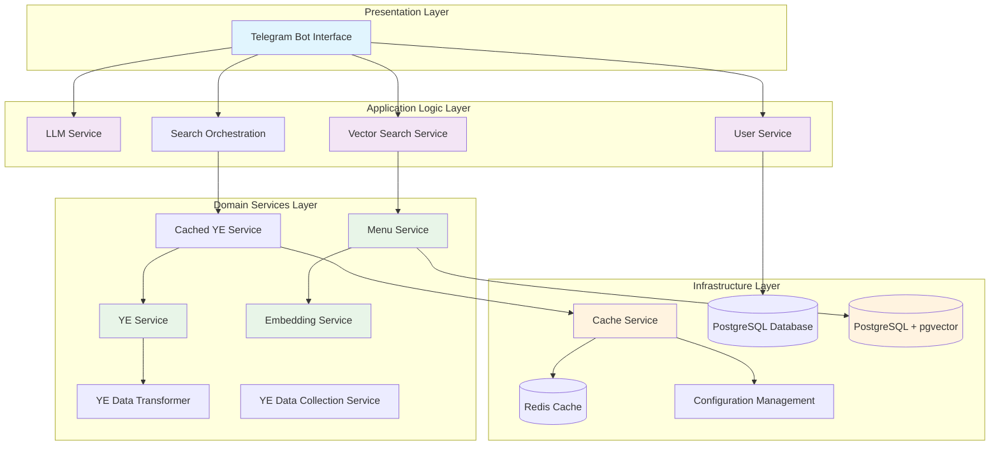
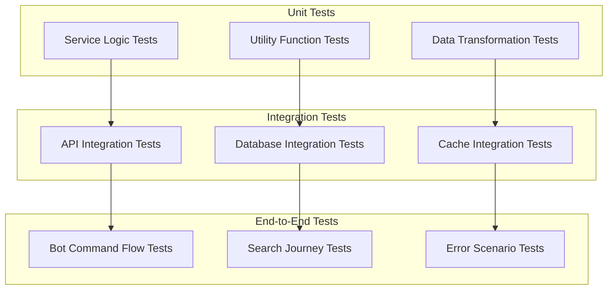

# Food Talker Design System Documentation

## Overview

The Food Talker system is a Node.js-based Telegram bot application designed for intelligent food search and restaurant recommendations. Built with TypeScript and leveraging modern architectural patterns, the system integrates multiple external services including Yandex.Eda API and LLM services to provide natural language food search capabilities.

**Current Implementation Status**: The project is in active development with core services, data models, and infrastructure components implemented. Vector search capabilities have been added with PostgreSQL + pgvector integration and local embedding generation. The bot interface layer is planned but not yet implemented. Recent refactoring has improved code organization, type safety, and service architecture.

## Technology Stack & Dependencies

### Core Technologies
- **Runtime**: Node.js (>=22.15.0 <23.0.0)
- **Language**: TypeScript (^5.8.3)
- **Package Manager**: npm (>=10.0.0)
- **Execution**: ts-node for development

### Key Dependencies
- **Bot Framework**: Telegraf (^4.16.3) - Telegram Bot API wrapper
- **Databases**: PostgreSQL (^8.16.3) for vector storage and persistence, Redis (^5.8.2) for caching
- **Vector Database**: pgvector extension for PostgreSQL
- **Task Scheduling**: node-cron (^4.2.1) for periodic data updates
- **Testing**: Vitest (^3.2.4) with comprehensive test coverage
- **Linting**: ESLint (^9.25.1) with stylistic and perfectionist plugins
- **Utilities**: lodash, uuid, jsonrepair, dotenv

## Architecture Overview

### High-Level Architecture



### Architectural Layers

#### 1. Presentation Layer
- **Telegram Bot Handlers**: Process user commands and messages
- **Middleware**: Authentication, rate limiting, error handling
- **Message Formatting**: Response presentation and inline keyboards

#### 2. Application Logic Layer
- **LLM Service**: Natural language query transformation and result enhancement
- **User Service**: User lifecycle management and context handling
- **Search Orchestration**: Coordinates between services for complex queries

#### 3. Domain Services Layer
- **YE Service**: Direct Yandex.Eda API integration with rate limiting
- **YE Data Transformer**: Raw API data to domain model transformation
- **Cached YE Service**: Performance optimization with intelligent caching
- **YE Data Collection Service**: Automated data synchronization

#### 4. Infrastructure Layer
- **Cache Service**: Multi-provider caching abstraction (Redis/Memory)
- **Database Management**: PostgreSQL connection pooling and migrations
- **Configuration Management**: Environment-aware configuration system
- **Logging & Monitoring**: Structured logging and error tracking

## Component Architecture

### Service Layer Architecture

```mermaid
classDiagram
    class LLMService {
        +transformQuery(query: string) Promise~TStructuredQuery~
        +enhanceSearchResults(results: TSearchResult[]) Promise~TSearchResult[]~
        -callLLM(prompt: string) Promise~string~
        -parseStructuredQuery(response: string) TStructuredQuery
    }
    
    class UserService {
        +createUser(telegramId: number) Promise~TUser~
        +getUser(telegramId: number) Promise~TUser~
        +updateUserCity(telegramId: number, city: string) Promise~TUser~
        +getUserSearchHistory(telegramId: number) Promise~TSearchHistoryItem[]~
    }
    
    class YEApiService {
        +requestRestaurants(coordinates: TCoordinates) Promise~TYERestaurantFromServer[]~
        +requestRestaurantMenu(id: string, coordinates: TCoordinates, brandSlug: string) Promise~TYEMenuItemFromServer[]~
        +getRestaurants(city: EAvailableCities) Promise~TYERestaurant[]~
        +getRestaurantMenu(id: string, city: EAvailableCities) Promise~TMenuItem[]~
        +checkRateLimit() boolean
        -makeRequest(endpoint: string) Promise~any~
    }
    
    class YESearchService {
        +searchItems(query: TStructuredQuery, city: EAvailableCities) Promise~TMenuItem[]~
        +searchRestaurants(query: TStructuredQuery, city: EAvailableCities) Promise~TYERestaurant[]~
    }
    
    class VectorSearchService {
        +searchMenu(naturalQuery: string, options?: TVectorMenuSearchOptions) Promise~TVectorSearchResultItem[]~
    }
    
    class MenuService {
        +createMenuItem(menuItem: TMenuItem) Promise~TVectorMenuItem~
        +createMenu(menu: TMenuItem[]) Promise~void~
        +searchByEmbedding(queryEmbedding: number[], options?: TVectorMenuSearchOptions) Promise~TVectorSearchResultItem[]~
        +getMenuItem(menuItemId: string) Promise~TVectorSearchResultItem~
        +deleteMenuItem(menuItemId: string) Promise~boolean~
    }
    
    class EmbeddingService {
        +generateEmbedding(text: string) Promise~number[]~
        +generateEmbeddings(texts: string[]) Promise~number[][]~
    }
    
    class CacheService {
        +get(key: string) Promise~any~
        +set(key: string, value: any, ttl?: number) Promise~void~
        +delete(key: string) Promise~void~
        +clear() Promise~void~
        +close() Promise~void~
    }
    
    LLMService --> CacheService
    UserService --> CacheService
    YEApiService --> CacheService
    YESearchService --> YEApiService
    VectorSearchService --> MenuService
    VectorSearchService --> EmbeddingService
    MenuService --> EmbeddingService
```



### 1. Bot Layer (Planned - Not Yet Implemented)

**Note**: The bot interface layer is currently planned but not implemented. The directory structure exists (`src/bot/handlers/`, `src/bot/middleware/`) but contains no files.

**Planned Bot Handler Interface**:
```typescript
interface TBotHandler {
  start(): Promise<void>
  stop(): Promise<void>
  handleMessage(ctx: TTelegrafContext): Promise<void>
  handleCommand(ctx: TTelegrafContext): Promise<void>
}
```

**Planned Command Handlers**:
- `/start` - User registration
- `/help` - Help information
- `/address` - Change delivery city
- `/history` - Search history
- `/cancel` - Cancel current action

### 2. User Management (`src/services/user/`)

**UserService** - Управление пользователями
```typescript
interface TUserService {
  createUser(telegramId: number, chatId: number): Promise<TUser>
  getUser(telegramId: number): Promise<TUser | null>
  updateUserCity(telegramId: number, city: string): Promise<TUser>
  updateSubscription(telegramId: number, subscription: TSubscriptionType): Promise<TUser>
  checkSubscriptionExpiry(): Promise<TUser[]>
}

interface TUserServiceFactory {
  createUserService(): TUserService
}

interface TUserRepository {
  createUser(user: TUser): Promise<TUser>
  getUser(telegramId: number): Promise<TUser | null>
  updateUser(telegramId: number, updates: Partial<TUser>): Promise<TUser>
  deleteUser(telegramId: number): Promise<void>
}

interface TUserRepositoryFactory {
  createUserRepository(): TUserRepository
}

interface TUser {
  telegramId: number
  chatId: number
  city: EAvailableCities
  subscription: ESubscriptionType
  subscriptionExpiry: Date | null
  createdAt: Date
  updatedAt: Date
}

enum ESubscriptionType {
  BASIC = 'basic',
}

enum EAvailableCities {
  PERM = 'Пермь',
  VORONEZH = 'Воронеж',
}
```

### 3. Search Engine (`src/services/search/`)

**SearchService** - Основной поисковый сервис
```typescript
interface TSearchService {
  searchFood(query: string, userId: number): Promise<TSearchResult[]>
  processNaturalLanguageQuery(query: string): Promise<TStructuredQuery>
  filterByGeolocation(results: TSearchResult[], city: string): Promise<TSearchResult[]>
  enhanceResultsWithLLM(results: TSearchResult[], originalQuery: string): Promise<TSearchResult[]>
}
```

**SchedulerService** - Планировщик задач

Общий сервис для управления запланированными задачами приложения с использованием node-cron. Поддерживает добавление, удаление, запуск и остановку задач, а также отслеживание статистики выполнения.

**AppSchedulerService** - Управление задачами приложения

Сервис для настройки и управления всеми запланированными задачами приложения:
- Обновление данных ресторанов Яндекс.Еда каждые 40 минут
- Очистка просроченных блюд каждые 30 минут

**VectorSearchService** - Векторный поиск по меню
```typescript
interface TVectorSearchService {
  searchMenu(naturalQuery: string, options?: TVectorMenuSearchOptions): Promise<TVectorSearchResultItem[]>
}

interface TSearchServiceFactory {
  createSearchService(): TSearchService
}

interface TStructuredQuery {
  restaurants?: string[]
  tags?: string[]
  priceRange?: TPriceRange
  exclusions?: {
    restaurants?: string[]
    tags?: string[]
    priceRange?: TPriceRange
  }
}

interface TPriceRange {
  min: number
  max: number
}

interface TSearchResult {
  id: string
  name: string
  restaurant: TRestaurantInfo
  description: string
  tags: string[]
  price: number
  image: string
  orderUrl: string
}
```

**LLMService** - Интеграция с LLM
```typescript
interface TLLMService {
  transformQuery(naturalQuery: string): Promise<TStructuredQuery>
  enhanceSearchResults(results: TSearchResult[], query: string): Promise<TSearchResult[]>
  validateQueryStructure(query: TStructuredQuery): boolean
}
```

### 4. Menu Management (`src/services/menu/`)

**MenuService** - Управление меню с векторным поиском
```typescript
interface TMenuService {
  createMenuItem(menuItem: TMenuItem): Promise<TVectorMenuItem>
  createMenu(menu: TMenuItem[]): Promise<void>
  searchByEmbedding(queryEmbedding: number[], options?: TVectorMenuSearchOptions): Promise<TVectorSearchResultItem[]>
  getMenuItem(menuItemId: string): Promise<TVectorSearchResultItem | null>
  deleteMenuItem(menuItemId: string): Promise<boolean>
}
```

**Фильтрация по городу**: Метод `searchByEmbedding` поддерживает фильтрацию по городу с использованием координат ресторанов. При указании параметра `city` система автоматически фильтрует результаты по радиусу доставки (по умолчанию 50 км) от центра указанного города.

**TTL для записей**: Каждая запись в таблице `dishes` имеет поле `expires_at` с временем истечения срока действия (30 минут). Просроченные записи автоматически удаляются планировщиком задач каждые 30 минут, что обеспечивает синхронизацию с TTL кеша меню в Redis.

**EmbeddingService** - Генерация эмбеддингов
```typescript
interface TEmbeddingService {
  generateEmbedding(text: string): Promise<number[]>
  generateEmbeddings(texts: string[]): Promise<number[][]>
}
```

### 5. Data Aggregation (`src/services/platforms/yandexEda/`)

**YEApiService** - Основной API клиент для Yandex.Eda с кэшированием
```typescript
interface TYEService {
  requestRestaurants(coordinates: TCoordinates): Promise<TYERestaurantFromServer[]>
  requestRestaurantMenu(id: string, coordinates: TCoordinates, brandSlug: string): Promise<TYEMenuItemFromServer[]>
  checkRateLimit(): boolean
  
  // Cached methods
  getRestaurants(city: EAvailableCities): Promise<TYERestaurant[]>
  getRestaurantMenu(id: string, city: EAvailableCities): Promise<TMenuItem[]>
  clearCache(pattern?: string): Promise<void>
  getCacheStats(): Promise<{ restaurants: number; menus: number }>
}

interface TYERestaurant {
  id: string
  name: string
  coordinates: TCoordinates
  minimumOrderAmount?: number
  lastUpdated: Date
  additionalInfo: {
    brandSlug: string
  }
}

interface TMenuItem {
  id: string
  name: string
  description: string
  ingredients: string[]
  price: number
  image: string
  available: boolean
  restaurant: TYERestaurant
}

// Yandex.Eda API Response Types
interface TYERestaurantFromServer {
  name: TYEText
  slug: string
  brand: TYEBrand
  analytics?: string
  picture?: TYEPicture
  left_meta?: TYELeftMeta[]
  features?: TYEFeatures
  chips?: TYEChip[]
}

// API Configuration Types
interface TYEApiConfig {
  baseUrl: string
  headers: Record<string, string>
  rateLimits: TYERateLimitConfig
  timeout: number
  retries: number
  delayBetweenRequestsMs: number
}

interface TYERateLimitConfig {
  requestsPerMinute: number
  requestsPerHour: number
  windowSizeMs: number
}

interface TYERateLimitState {
  requests: number[]
  lastReset: number
}

interface TYEMenuItemFromServer {
  id: number
  name: string
  description: string
  descriptions?: TYEDescription[]
  available: boolean
  inStock: boolean | null
  price: number
  decimalPrice: string
  promoTypes: string[]
  optionsGroups: unknown[]
  picture?: TYEPicture
  weight?: string
  adult: boolean
  shippingType: string
  measure?: TYEMeasure
  nutrients_detailed?: TYENutrientsDetailed
  publicId: string
}
```


**YEApiService** - Основной API клиент для Yandex.Eda с кэшированием
```typescript
interface TYEService {
  requestRestaurants(coordinates: TCoordinates): Promise<TYERestaurantFromServer[]>
  requestRestaurantMenu(id: string, coordinates: TCoordinates, brandSlug: string): Promise<TYEMenuItemFromServer[]>
  checkRateLimit(): boolean
  
  // Cached methods
  getRestaurants(city: EAvailableCities): Promise<TYERestaurant[]>
  getRestaurantMenu(id: string, city: EAvailableCities): Promise<TMenuItem[]>
  clearCache(pattern?: string): Promise<void>
  getCacheStats(): Promise<{ restaurants: number; menus: number }>
}
```

**YEDataTransformer** - Трансформация данных API в внутренние модели
```typescript
interface TYEDataTransformer {
  transformRestaurant(yePlace: TYERestaurantFromServer, coordinates: TCoordinates): TYERestaurant
  transformMenuItem(yeMenuItem: TYEMenuItemFromServer, restaurant: TYERestaurant): TMenuItem
  transformRestaurants(yePlaces: TYERestaurantFromServer[], coordinates: TCoordinates): TYERestaurant[]
  transformMenuItems(yeMenuItems: TYEMenuItemFromServer[], restaurant: TYERestaurant): TMenuItem[]
}
```

**YEDataCollectionService** - Планировщик обновления данных
```typescript
interface TYEDataCollectionService {
  startCollection(): Promise<void>
  stopCollection(): void
  updateRestaurantData(city?: EAvailableCities): Promise<void>
  updateMenuData(restaurantId: string, city: EAvailableCities): Promise<void>
  scheduleUpdates(): void
  getCollectionStats(): TCollectionStats
}

interface TCollectionStats {
  lastUpdateTime: Date | null
  totalRestaurants: number
  totalMenuItems: number
  updateFrequency: string
  isRunning: boolean
  errors: number
}
```

**CacheService** - Универсальный кэш с TTL и LRU
```typescript
interface TCacheService {
  get<T>(key: string): Promise<T | null>
  set<T>(key: string, value: T, ttlSeconds?: number): Promise<void>
  delete(key: string): Promise<void>
  clear(): Promise<void>
  has(key: string): Promise<boolean>
  getStats(): Promise<TCacheStats>
  close(): Promise<void>
}

interface TCacheStats {
  totalKeys: number
  memoryUsage: number // bytes
  hitRate: number // 0-1
  missRate: number // 0-1
}

interface TCacheServiceConfig {
  type: 'memory' | 'redis'
  ttl: number
  maxSize: number
  redisUrl?: string
}

interface TMemoryCacheItem<T> {
  value: T
  expiresAt: number
  accessCount: number
  lastAccessed: number
}
```

### 6. Geolocation (`src/services/geo/`)

**GeolocationService** - Работа с геолокацией
```typescript
interface TGeolocationService {
  getCityCoordinates(cityName: string): Promise<TCoordinates>
  isDeliveryAvailable(restaurant: TRestaurant, userCity: string): Promise<boolean>
  filterByDeliveryZone(restaurants: TRestaurant[], city: string): Promise<TRestaurant[]>
}

interface TCoordinates {
  latitude: number
  longitude: number
}
```

### 7. Message Formatting (`src/services/message/`)

**MessageFormatter** - Форматирование сообщений
```typescript
interface TMessageFormatter {
  formatSearchResults(results: TSearchResult[]): string
  formatRestaurantCard(restaurant: TRestaurant, items: TMenuItem[]): string
  formatWelcomeMessage(user: TUser): string
  formatErrorMessage(error: TAppError): string
  createInlineKeyboard(results: TSearchResult[]): TInlineKeyboardMarkup
}
```

## Data Models

### Core Entities

```typescript
// User Entity
interface TUser {
  telegramId: number
  chatId: number
  city: EAvailableCities
  subscription: TSubscriptionType
  subscriptionExpiry: Date | null
  searchHistory: TSearchHistoryItem[]
  createdAt: Date
  updatedAt: Date
}

// Search History
interface TSearchHistoryItem {
  id: string
  query: string
  structuredQuery: TStructuredQuery
  results: TSearchResult[]
  timestamp: Date
}

// Restaurant Data
interface TRestaurant {
  id: string
  name: string
  coordinates: TCoordinates
  minimumOrderAmount?: number
  lastUpdated: Date
  additionalInfo?: object
}

// Menu Item
interface TMenuItem {
  id: string
  name: string
  description: string
  ingredients: string[]
  price: number
  image: string
  available: boolean
  restaurant: TRestaurant
  category: string
}

// Vector Menu Item with Embeddings
interface TVectorMenuItem extends TMenuItem {
  embedding: number[]
}

// Vector Search Result
interface TVectorSearchResultItem extends TSearchResultItem {
  similarity: number
}

// Vector Search Options
interface TVectorMenuSearchOptions {
  limit?: number
  category?: string
  restaurantNames?: string[]
  minPrice?: number
  maxPrice?: number
  minSimilarity?: number
  city?: string
  deliveryRadiusKm?: number
}

// Yandex.Eda API Response Types
interface TYEText {
  value: string
  color: TYEColor
}

interface TYEColor {
  light: string
  dark: string
}

interface TYEBrand {
  slug: string
  name: string
  business: string
}

interface TYEPicture {
  image: string
  uri?: string
  ratio?: number
  scale?: string
}

interface TYELeftMeta {
  id: string
  type: string
  payload: {
    icon?: {
      type: string
      icon: TYEIcon
    }
    text: TYEText
    type: string
  }
}

interface TYEIcon {
  color?: TYEColor
  url: string
}

interface TYEFeatures {
  rating?: {
    text: TYEText
    icon: TYEIcon
  }
  user_collections?: {
    in_collections: boolean
  }
}

interface TYEChip {
  type: string
  payload: {
    background: TYEColor
    text: TYEText
  }
}

interface TYEDescription {
  title: string
  text: string
  expanded_text: string
  collapsed_text: string
  collapsed_text_lines_count: number
}

interface TYEMeasure {
  value: string
  measure_unit: string
}

interface TYENutrient {
  name: string
  value: string
  unit: string
}

interface TYENutrientsDetailed {
  calories: TYENutrient
  proteins: TYENutrient
  fats: TYENutrient
  carbohydrates: TYENutrient
  description: {
    value: string
  }
}
```

### Configuration Models

```typescript
interface TBotConfig {
  telegramToken: string
  llmApiUrl: string
  llmApiKey: string
  database: TDatabaseConfig
  vectorDatabase: TVectorDatabaseConfig
  cache: TCacheConfig
  yandexEda: TYandexEdaConfig
  availableCities: EAvailableCities[]
  sanitizer: TSanitizerConfig
  fallbackFoodImage: string
}

interface TDatabaseConfig {
  host: string
  port: number
  database: string
  user: string
  password: string
  maxConnections: number
}

interface TVectorDatabaseConfig {
  host: string
  port: number
  database: string
  user: string
  password: string
  maxConnections: number
}

interface TCacheConfig {
  ttl: number
  maxSize: number
  redisUrl?: string
}

interface TYandexEdaConfig {
  baseUrl: string
  headers: Record<string, string>
  rateLimits: {
    requestsPerMinute: number
    requestsPerHour: number
  }
  delayBetweenRequestsMs: number
  retries: number
}

interface TSanitizerConfig {
  userSearchPrompt: {
    maxLength: number
    minLength: number
  }
}

interface TEnvironment {
  NODE_ENV: 'development' | 'production'
  BOT_TOKEN: string
  LLM_API_URL: string
  LLM_API_KEY: string
  REDIS_URL?: string
  LOG_LEVEL: 'debug' | 'info' | 'warn' | 'error'
  WEBHOOK_URL?: string
  WEBHOOK_SECRET?: string
  DB_HOST: string
  DB_PORT: string
  DB_NAME: string
  DB_USER: string
  DB_PASSWORD: string
  DB_MAX_CONNECTIONS: string
  EMBEDDING_API_BASE_URL: string
  EMBEDDING_API_KEY: string
  EMBEDDING_MODEL_NAME: string
}
```

## Error Handling

### Error Types

```typescript
enum TErrorType {
  API_ERROR = 'API_ERROR',
  CACHE_ERROR = 'CACHE_ERROR',
  CITY_NOT_SUPPORTED = 'CITY_NOT_SUPPORTED',
  DATA_COLLECTION_ERROR = 'DATA_COLLECTION_ERROR',
  DATABASE_ERROR = 'DATABASE_ERROR',
  LLM_ERROR = 'LLM_ERROR',
  NETWORK_ERROR = 'NETWORK_ERROR',
  RATE_LIMIT_ERROR = 'RATE_LIMIT_ERROR',
  SYSTEM_ERROR = 'SYSTEM_ERROR',
  USER_NOT_FOUND = 'USER_NOT_FOUND',
  VALIDATION_ERROR = 'VALIDATION_ERROR',
}

interface TAppError extends Error {
  type: TErrorType
  code: string
  details?: unknown
  isUserFacing: boolean
}

// Реализованы статические фабричные методы:
// AppError.validationError(), .apiError(), .networkError()
// AppError.llmError(), .databaseError(), .rateLimitError()
// AppError.systemError(), .userNotFound(), .cityNotSupported()
// AppError.cacheError(), .dataCollectionError()
```

### Error Handling Strategy

1. **User-Facing Errors** - Понятные сообщения пользователю
2. **System Errors** - Логирование и уведомление администратора
3. **Graceful Degradation** - Продолжение работы при сбоях отдельных компонентов
4. **Retry Logic** - Автоматические повторы для временных сбоев

### Error Recovery

```typescript
interface TErrorHandler {
  handleBotError(error: TAppError, ctx: TTelegrafContext): Promise<void>
  handleAPIError(error: TAppError): Promise<void>
  handleLLMError(error: TAppError, fallbackStrategy: 'simple_search' | 'cached_results'): Promise<TSearchResult[]>
  notifyAdmin(error: TAppError): Promise<void>
}
```

## Performance and Caching

### Caching Strategy

Реализован многоуровневый кэш с автоматической очисткой:

1. **CacheService** - Универсальный кэш с вариантами in-memory или Redis
   - Provider pattern с поддержкой Memory и Redis
   - LRU eviction при превышении maxSize
   - TTL с автоматической очисткой каждые 5 минут
   - Статистика hit/miss rate и memory usage
   - Асинхронные методы с Promise возвратами

2. **Restaurant Data Cache** - TTL: 1 час (3600 сек)
   - Ключ: `restaurants:{city}:{coordinates}`
   - Автообновление каждые 40 минут

3. **Menu Data Cache** - TTL: 30 минут (1800 сек)  
   - Ключ: `menu:{restaurantId}:{city}:{coordinates}`
   - Ленивая загрузка при запросе

4. **Search Results Cache** - TTL: 15 минут (900 сек)
   - Ключ: `search:{city}:{coordinates}:{normalizedQuery}`
   - Стабильные ключи с нормализацией порядка параметров

5. **Cache Invalidation**
   - Автоматическая очистка просроченных записей
   - Ручная инвалидация по паттернам
   - Graceful degradation при ошибках кэша
   - Метод `close()` для корректного завершения работы

**LLM Response Cache** - Кэширование ответов LLM для похожих запросов (TTL: 24 часа)

### Rate Limiting

Реализован в YEService с использованием sliding window:

```typescript
interface TYERateLimitState {
  requests: number[]
  lastReset: number
}

interface TYEApiConfig {
  rateLimits: {
    requestsPerMinute: number
    requestsPerHour: number
    windowSizeMs: number
  }
  timeout: number
  retries: number
}

// Лимиты (из botConfig):
// - Яндекс.Еда API: настраивается в конфигурации
// - Автоматические повторы с exponential backoff
// - Проверка лимитов перед каждым запросом

// Лимиты:
// - LLM API: 50 запросов в минуту
```

## Integration Patterns

### Yandex.Eda Integration

Реализованная архитектура состоит из четырёх слоёв:

#### 1. YEApiService - Основной API клиент с кэшированием
```typescript
class YEApiService implements TYEService {
  private readonly config: TYEApiConfig
  private rateLimitState: TYERateLimitState
  private readonly cacheTTL = {
    restaurants: 3600, // 1 час
    menu: 1800,        // 30 минут
  }

  async requestRestaurants(coordinates: TCoordinates): Promise<TYERestaurantFromServer[]>
  async requestRestaurantMenu(id: string, coordinates: TCoordinates, brandSlug: string): Promise<TYEMenuItemFromServer[]>
  async getRestaurants(city: EAvailableCities): Promise<TYERestaurant[]>
  async getRestaurantMenu(id: string, city: EAvailableCities): Promise<TMenuItem[]>
  checkRateLimit(): boolean
}
```

#### 2. YEDataTransformer - Трансформация данных
```typescript
class YEDataTransformer {
  transformRestaurant(yePlace: TYERestaurantFromServer, coordinates: TCoordinates): TYERestaurant
  transformMenuItem(yeMenuItem: TYEMenuItemFromServer, restaurant: TRestaurant): TMenuItem
  
  // Умное извлечение ингредиентов из разных форматов описаний:
  // - Точный title "Состав"
  // - Текст с "Состав:"
  // - Автоопределение списков ингредиентов по структуре
  private extractIngredients(yeMenuItem: TYEMenuItemFromServer): string[]
}
```

#### 3. YESearchService - Поисковый сервис
```typescript
class YESearchService {
  async searchItems(query: TStructuredQuery, city: EAvailableCities): Promise<TMenuItem[]>
  async searchRestaurants(query: TStructuredQuery, city: EAvailableCities): Promise<TYERestaurant[]>
}
```

#### 4. YEDataCollectionService - Планировщик обновлений
```typescript
class YEDataCollectionService {
  private frequencyMin = {
    restaurant: 40, // Обновление ресторанов каждые 40 минут
    cache: 30,      // Очистка кэша каждые 30 минут
  }

  async startCollection(): Promise<void>
  stopCollection(): void
  scheduleUpdates(): void // Использует node-cron
}
```

### LLM Integration

```typescript
interface TLLMClient {
  transformQuery(query: string): Promise<TStructuredQuery>
  enhanceResults(results: TSearchResult[], originalQuery: string): Promise<TSearchResult[]>
  validateResponse(response: any): boolean
}

class LlamaService implements TLLMClient {
  private apiUrl: string
  private apiKey: string
  
  async transformQuery(query: string): Promise<TStructuredQuery> {
    // Преобразование естественного запроса в структурированный JSON
    const prompt = this.buildQueryTransformPrompt(query)
    const response = await this.callLLM(prompt)
    return this.parseStructuredQuery(response)
  }
}
```

### Vector Search Integration

```typescript
interface TVectorSearchFlow {
  // Генерация эмбеддингов для текста
  generateEmbedding(text: string): Promise<number[]>
  
  // Векторный поиск по меню
  searchMenu(naturalQuery: string, options?: TVectorMenuSearchOptions): Promise<TVectorSearchResultItem[]>
  
  // Создание векторных записей меню
  createVectorMenuItem(menuItem: TMenuItem): Promise<TVectorMenuItem>
}

class VectorSearchService {
  constructor(
    private readonly embeddingService: EmbeddingService,
    private readonly menuService: MenuService,
  ) {}

  async searchMenu(naturalQuery: string, options?: TVectorMenuSearchOptions): Promise<TVectorSearchResultItem[]> {
    // 1. Генерируем эмбеддинг для запроса
    const queryEmbedding = await this.embeddingService.generateEmbedding(naturalQuery)
    
    // 2. Выполняем векторный поиск
    const results = await this.menuService.searchByEmbedding(queryEmbedding, options)
    
    return results
  }
}

class EmbeddingService {
  async generateEmbedding(text: string): Promise<number[]> {
    // Использует локальную генерации эмбеддингов
    // Модель: sentence-transformers/all-MiniLM-L6-v2
  }
}
```

### Database Schema

Реализована PostgreSQL база данных с pgvector расширением для векторного поиска:

```typescript
// Users Table
interface TUserEntity {
  telegram_id: number // PRIMARY KEY
  chat_id: number
  city: string
  subscription_type: string
  subscription_expiry: string | null // ISO string
  created_at: string // ISO string DEFAULT now()
  updated_at: string // ISO string DEFAULT now()
}

// Search History Table  
interface TSearchHistoryEntity {
  id: string // UUID PRIMARY KEY
  user_telegram_id: number // FOREIGN KEY
  query: string
  structured_query: string // JSON string
  results_count: number
  created_at: string // ISO string DEFAULT now()
}

// Restaurants Cache Table
interface TRestaurantCacheEntity {
  id: string // PRIMARY KEY
  name: string
  data: string // JSON string
  city: string
  last_updated: string // ISO string DEFAULT now()
  is_active: number // INTEGER DEFAULT 1 (boolean)
}

// Database Connection Management
interface TDatabaseConnection {
  query<T>(sql: string, params?: unknown[]): Promise<T[]>
  get<T>(sql: string, params?: unknown[]): Promise<T | undefined>
  run(sql: string, params?: unknown[]): Promise<{ lastID: number; changes: number }>
  close(): Promise<void>
}

interface TDatabasePool {
  getConnection(): Promise<TDatabaseConnection>
  closeAll(): Promise<void>
  getActiveConnections(): number
}

interface TMigration {
  version: number
  description: string
  up: (db: TDatabaseConnection) => Promise<void>
  down: (db: TDatabaseConnection) => Promise<void>
}

// Vector Database Schema
interface TVectorMenuItemEntity {
  id: string
  name: string
  description: string
  price: number
  restaurant_id: string
  restaurant_name: string
  restaurant_latitude: number
  restaurant_longitude: number
  available: boolean
  order_url: string
  category: string
  image: string
  ingredients: string[]
  embedding: number[] // pgvector column
  created_at: string
  updated_at: string
}
```

## Testing Strategy

### Test Architecture



### Test Implementation Coverage

#### Implemented Test Suites
1. **UserService Tests** - Complete service method coverage
2. **YEApiService Tests** - API calls, rate limiting, retry logic, caching
3. **YEDataTransformer Tests** - Data transformation and ingredient extraction
4. **YEDataCollectionService Tests** - Cron job scheduling and statistics
5. **CacheService Tests** - Provider pattern and TTL behavior
6. **SearchService Tests** - Search orchestration and LLM integration
7. **LLMService Tests** - LLM integration with caching and error handling
8. **MenuService Tests** - Vector menu operations and embedding generation
9. **EmbeddingService Tests** - Embedding generation and validation
10. **VectorSearchService Tests** - Vector search orchestration

#### Test Utilities & Mocking
- **Test Framework**: Vitest (^3.2.4) with TypeScript support
- **Mock Strategy**: Comprehensive mocking of external dependencies
- **Time Control**: `vi.useFakeTimers()` for TTL and scheduling tests
- **Fetch Mocking**: Mock HTTP requests for API testing
- **Database Mocking**: In-memory database for isolation
- **Memory FileSystem**: memfs for file system mocking

#### Test Configuration
```typescript
// vitest.config.mts
export default defineConfig({
  test: {
    root: './',
    setupFiles: path.resolve(__dirname, 'src/vitest/setup.ts'),
    pool: 'threads',
    alias: {
      '@': path.resolve(__dirname, './src'),
    },
  },
});
```

### Integration Testing

1. **Bot Command Tests**
   - Тестирование команд через mock Telegram updates
   - Проверка flow регистрации пользователя
   - Тестирование поискового flow

2. **External API Tests**
   - Mock тесты для Yandex.Eda API
   - Mock тесты для LLM API
   - Тестирование error handling

### End-to-End Testing

1. **User Journey Tests**
   - Полный цикл: регистрация → поиск → результаты
   - Тестирование edge cases
   - Performance тесты

## Security Considerations

### Data Protection

1. **API Keys Security**
   - Хранение в environment variables
   - Ротация ключей
   - Шифрование sensitive данных

2. **User Data Privacy**
   - Минимизация хранимых данных
   - Соблюдение ФЗ-152
   - Автоматическое удаление старых данных

3. **Vector Database Security**
   - Шифрование соединений с PostgreSQL
   - Ограничение доступа к векторным данным
   - Валидация входных данных для эмбеддингов

4. **Rate Limiting & DDoS Protection**
   - Лимиты на пользователя
   - Лимиты на IP
   - Graceful degradation

### Input Validation

Реализована модульная система валидации и санитизации:

#### Validation (`src/utils/Validator.ts`)
```typescript
interface TValidator {
  // Input validation (from user)
  validateSearchQuery(query: string): TValidationResult
  validateCity(city: string): TValidationResult
  validateTelegramId(telegramId: number): TValidationResult
  validateChatId(chatId: number): TValidationResult
  validateSubscriptionType(subscription: string): TValidationResult
  
  // Business logic validation (internal structures)
  validatePriceRange(min?: number, max?: number): TValidationResult
  validateCoordinates(latitude: number, longitude: number): TValidationResult
}

interface TValidationResult {
  isValid: boolean
  errors: string[]
  sanitizedInput?: unknown
}
```

#### Sanitizer (`src/utils/Sanitizer.ts`)
```typescript
interface TSanitizer {
  sanitizeSearchQuery(query: string): string
  sanitizeCity(city: string): string
  sanitizeRestaurantName(name: string): string
  removeHarmfulContent(text: string): string
  normalizeWhitespace(text: string): string
}
```

#### City Validator (`src/utils/CityValidator.ts`)
```typescript
interface TCityValidator {
  isSupported(city: string): boolean
  getCityCoordinates(city: EAvailableCities): TCoordinates | null
  normalizeCityName(city: string): string
  getSupportedCities(): EAvailableCities[]
  isInDeliveryZone(coordinates: TCoordinates, city: EAvailableCities): boolean
  calculateDistance(coord1: TCoordinates, coord2: TCoordinates): number
}
```

## Monitoring and Observability

### Logging Strategy

```typescript
interface TLogger {
  info(message: string, meta?: any): void
  warn(message: string, meta?: any): void
  error(message: string, error: Error, meta?: any): void
  debug(message: string, meta?: any): void
}

// ConsoleLogger implementation:
// - Структурированное логирование с метаданными
// - Поддержка уровней логирования (debug, info, warn, error)
// - Автоматическое форматирование ошибок
// - Контекстная информация для отладки

// Log Categories:
// - user.action - Действия пользователей
// - search.query - Поисковые запросы
// - api.call - Вызовы внешних API
// - llm.request - Запросы к LLM
// - error.system - Системные ошибки
// - cache.operation - Операции с кэшем
// - database.query - Запросы к базе данных
```

### Metrics Collection

```typescript
interface TMetricsCollector {
  incrementCounter(metric: string, tags?: Record<string, string>): void
  recordDuration(metric: string, duration: number, tags?: Record<string, string>): void
  recordGauge(metric: string, value: number, tags?: Record<string, string>): void
}

// Key Metrics:
// - search.requests.total
// - search.response_time
// - vector_search.requests.total
// - vector_search.response_time
// - vector_search.similarity_score
// - embedding.generation_time
// - embedding.model_usage
// - llm.requests.total
// - llm.cost.monthly
// - users.active.daily
// - errors.rate
```

### Health Checks

```typescript
interface THealthChecker {
  checkBotHealth(): Promise<THealthStatus>
  checkDatabaseHealth(): Promise<THealthStatus>
  checkExternalAPIs(): Promise<THealthStatus>
  checkLLMService(): Promise<THealthStatus>
}

interface THealthStatus {
  service: string
  status: 'healthy' | 'degraded' | 'unhealthy'
  latency?: number
  error?: string
  timestamp: Date
}
```

## Deployment Architecture

### Environment Configuration

```typescript
interface TEnvironment {
  NODE_ENV: 'development' | 'production'
  BOT_TOKEN: string
  LLM_API_URL: string
  LLM_API_KEY: string
  DATABASE_URL: string
  REDIS_URL?: string
  LOG_LEVEL: 'debug' | 'info' | 'warn' | 'error'
  WEBHOOK_URL?: string
  WEBHOOK_SECRET?: string
}

// Environment validation function
function validateEnvironment(): void {
  const required = [
    'BOT_TOKEN',
    'LLM_API_URL',
    'LLM_API_KEY',
    'EMBEDDING_API_BASE_URL',
    'EMBEDDING_API_KEY',
    'EMBEDDING_MODEL_NAME',
    'DB_HOST',
    'DB_PORT',
    'DB_NAME',
    'DB_USER',
  ];
  const missing = required.filter(key => !environment[key as keyof TEnvironment]);

  if (missing.length > 0) {
    throw AppError.validationError('MISSING_ENV_VARIABLES', `Необходимые переменные окружения не установлены: ${missing.join(', ')}`);
  }
}
```

### Scaling Strategy

1. **Horizontal Scaling**
   - Stateless bot instances
   - Load balancing через webhook
   - Shared cache layer (Redis)
   - Vector database clustering (PostgreSQL read replicas)

2. **Resource Management**
   - Memory usage monitoring
   - CPU usage optimization
   - Database connection pooling
   - Vector index optimization (pgvector HNSW indexes)

3. **Vector Search Optimization**
   - Embedding model caching
   - Batch embedding generation
   - Similarity search indexing
   - Query result caching

## Current Project Structure

### Implemented Components

```
src/
├── config/                    # ✅ Configuration Management
│   ├── bot/                  # Bot configuration
│   │   ├── index.ts          # Bot configuration object
│   │   └── types.ts          # Bot configuration types
│   └── environment/          # Environment configuration
│       ├── index.ts          # Environment variables and validation
│       └── types.ts          # Environment types
├── types/                     # ✅ Data Models
│   ├── menuItem.ts           # Menu item model
│   ├── restaurant.ts         # Restaurant domain model
│   ├── search.ts             # Search query models
│   └── telegram.ts           # Telegram-specific types
├── services/                  # ✅ Core Services
│   ├── cacheService/         # Cache abstraction layer
│   │   ├── providers/        # Cache provider implementations
│   │   │   ├── MemoryCacheProvider/
│   │   │   │   ├── MemoryCacheProvider.ts
│   │   │   │   └── types.ts
│   │   │   ├── RedisCacheProvider.ts
│   │   │   ├── RedisCacheProvider.test.ts
│   │   │   └── types.ts
│   │   ├── CacheService.ts
│   │   ├── CacheService.test.ts
│   │   ├── instances.ts
│   │   └── types.ts
│   ├── database/             # Database management
│   │   ├── PostgreSQL/
│   │   │   ├── PostgreSQL.ts
│   │   │   ├── PostgreSQLFactory.ts
│   │   │   └── types.ts
│   │   ├── MigrationRunner.ts
│   │   └── types.ts
│   ├── platforms/yandexEda/  # Yandex.Eda integration
│   │   ├── yeApiService/
│   │   │   ├── YEApiService.ts
│   │   │   ├── YEApiService.test.ts
│   │   │   ├── instances.ts
│   │   │   └── types.ts
│   │   ├── yeDataCollectionService/
│   │   │   ├── YEDataCollectionService.ts
│   │   │   ├── YEDataCollectionService.test.ts
│   │   │   ├── instances.ts
│   │   │   └── types.ts
│   │   ├── yeDataTransformer/
│   │   │   ├── YEDataTransformer.ts
│   │   │   ├── YEDataTransformer.test.ts
│   │   │   ├── instances.ts
│   │   │   └── types.ts
│   │   └── yeSearchService/
│   │       ├── YESearchService.ts
│   │       ├── YESearchService.test.ts
│   │       ├── instances.ts
│   │       └── types.ts
│   ├── search/               # Search services
│   │   ├── LLMService/
│   │   │   ├── LLMService.ts
│   │   │   ├── LLMService.test.ts
│   │   │   ├── instances.ts
│   │   │   └── types.ts
│   │   ├── SearchService/
│   │   │   ├── SearchService.ts
│   │   │   ├── SearchService.test.ts
│   │   │   ├── SearchServiceFactory.ts
│   │   │   ├── instances.ts
│   │   │   └── types.ts
│   │   └── VectorSearchService/
│   │       ├── VectorSearchService.ts
│   │       └── VectorSearchServiceFactory.ts
│   ├── user/                 # User management
│   │   ├── UserRepository/
│   │   │   ├── UserRepository.ts
│   │   │   ├── UserRepositoryFactory.ts
│   │   │   └── types.ts
│   │   ├── UserService/
│   │   │   ├── UserService.ts
│   │   │   ├── UserService.test.ts
│   │   │   ├── UserServiceFactory.ts
│   │   │   ├── instances.ts
│   │   │   └── types.ts
│   │   └── data/
│   │       └── collection/
│   ├── menu/                 # Menu management with vector search
│   │   ├── MenuRepository/
│   │   │   ├── MenuRepository.ts
│   │   │   ├── MenuRepositoryFactory.ts
│   │   │   └── types.ts
│   │   └── MenuService/
│   │       ├── MenuService.ts
│   │       ├── MenuServiceFactory.ts
│   │       └── types.ts
│   ├── EmbeddingService/     # Embedding generation
│   │   ├── EmbeddingService.ts
│   │   ├── EmbeddingServiceFactory.ts
│   │   └── types.ts
│   ├── message/              # ⏳ Planned message formatting
│   └── data/                 # ⏳ Planned data collection
│       └── collection/
├── utils/                    # ✅ Utility Functions
│   ├── AppError.ts           # Error handling and types
│   ├── CityValidator.ts      # City validation and coordinates
│   ├── ConsoleLogger.ts      # Logging framework
│   ├── Sanitizer.ts          # Input sanitization
│   ├── Validator.ts          # Input validation
│   └── sleep.ts              # Utility functions
```

### Utility Functions

**AppError** - Централизованная обработка ошибок
```typescript
class AppError extends Error {
  static validationError(message: string, details?: unknown): AppError
  static apiError(code: string, message: string, details?: unknown): AppError
  static networkError(message: string, details?: unknown): AppError
  static llmError(message: string, details?: unknown): AppError
  static databaseError(code: string, message: string, details?: unknown): AppError
  static rateLimitError(message: string, details?: unknown): AppError
  static systemError(message: string, details?: unknown): AppError
  static userNotFound(message: string, details?: unknown): AppError
  static cityNotSupported(message: string, details?: unknown): AppError
  static cacheError(message: string, details?: unknown): AppError
  static dataCollectionError(message: string, details?: unknown): AppError
}
```
```
├── vitest/                   # ✅ Test Configuration
│   ├── constants.ts          # Test constants
│   ├── general.test.ts       # General test utilities
│   └── setup.ts              # Test setup configuration
├── test/                     # ✅ Development Testing
│   ├── index.ts              # Manual testing scripts
│   ├── llm.ts                # LLM testing utilities
│   ├── redis.ts              # Redis testing
│   ├── places.json           # Test data
│   └── burger_king_ynrku.json # Sample restaurant data
├── research/                 # 📚 Research & Documentation
│   └── yandex eda/requests/  # API research files
├── bot/                      # ⏳ Planned Bot Interface
│   ├── handlers/             # (empty - planned)
│   └── middleware/           # (empty - planned)
└── index.ts                  # Main entry point with environment validation
```

### Main Entry Point

```typescript
// src/index.ts
import { validateEnvironment } from './config/environment';

validateEnvironment();
```

Приложение теперь включает валидацию окружения при запуске, что обеспечивает корректную работу всех сервисов.

### Legend
- ✅ **Fully Implemented**: Complete with tests and documentation
- ⏳ **Planned**: Directory structure exists, implementation pending
- 📚 **Research**: Documentation and research materials

## API Integration Details

### Yandex.Eda API Flow

1. **YEService Layer**:
   - Прямые API вызовы с rate limiting
   - Retry логика с exponential backoff
   - Обработка ошибок и таймаутов

2. **Data Transformation**:
   - YEDataTransformer преобразует TYERestaurantResponsed → TYERestaurant
   - TYEMenuItem → TMenuItem с умным извлечением ингредиентов
   - Обработка разных форматов описаний состава

3. **Caching Layer**:
   - CachedYEService добавляет кэширование поверх YEService
   - Разные TTL для разных типов данных
   - Автоматическая инвалидация просроченных записей

4. **Data Collection**:
   - YEDataCollectionService планирует обновления через cron
   - Первоначальная загрузка при старте
   - Статистика и мониторинг процесса сбора

### LLM Processing Flow

1. **Query Analysis** - Анализ пользовательского запроса
2. **Structure Extraction** - Извлечение структурированных параметров
3. **Result Enhancement** - Улучшение релевантности результатов
4. **Response Validation** - Проверка качества ответа

## Performance Requirements

### Response Time Targets

- Bot command response: < 1 секунда
- Search query processing: < 5 секунд
- LLM query transformation: < 3 секунды
- Database queries: < 500ms
- Cache hits: < 50ms

### Performance Targets
- **Bot Response Time**: < 1 second for commands
- **Search Processing**: < 5 seconds for complex queries
- **Vector Search**: < 2 seconds for semantic search
- **LLM Transformation**: < 3 seconds per request
- **Cache Hit Ratio**: > 80% for frequently accessed data
- **Concurrent Users**: Support up to 100 simultaneous users
- **Database Queries**: < 500ms for standard operations
- **Vector Database Queries**: < 1 second for similarity search
- **API Response Time**: < 2 seconds for external API calls
- **Memory Usage**: < 512MB for standard operation

### Current Development Scripts
```bash
# Development
npm start                    # Start with ts-node and environment validation

# Quality Assurance
npm run typecheck           # TypeScript type checking
npm run eslint              # Lint code
npm run eslint:fix          # Auto-fix linting issues
npm run test                # Run tests with Vitest
npm run test:watch          # Run tests in watch mode
npm run lint                # Full lint suite (type + lint + test)
```

### Deployment Considerations
- **Build Process**: No explicit build script defined (requires `tsc` for production)
- **Node.js Version**: Strict engine requirement (>=22.15.0 <23.0.0)
- **Production Deployment**: Needs build step for TypeScript compilation
- **Environment Configuration**: Uses dotenv for environment management with validation
- **Environment Validation**: Application validates required environment variables on startup
- **Vector Database**: Requires PostgreSQL with pgvector extension installed
- **Embedding Model**: Uses @xenova/transformers for local embedding generation
